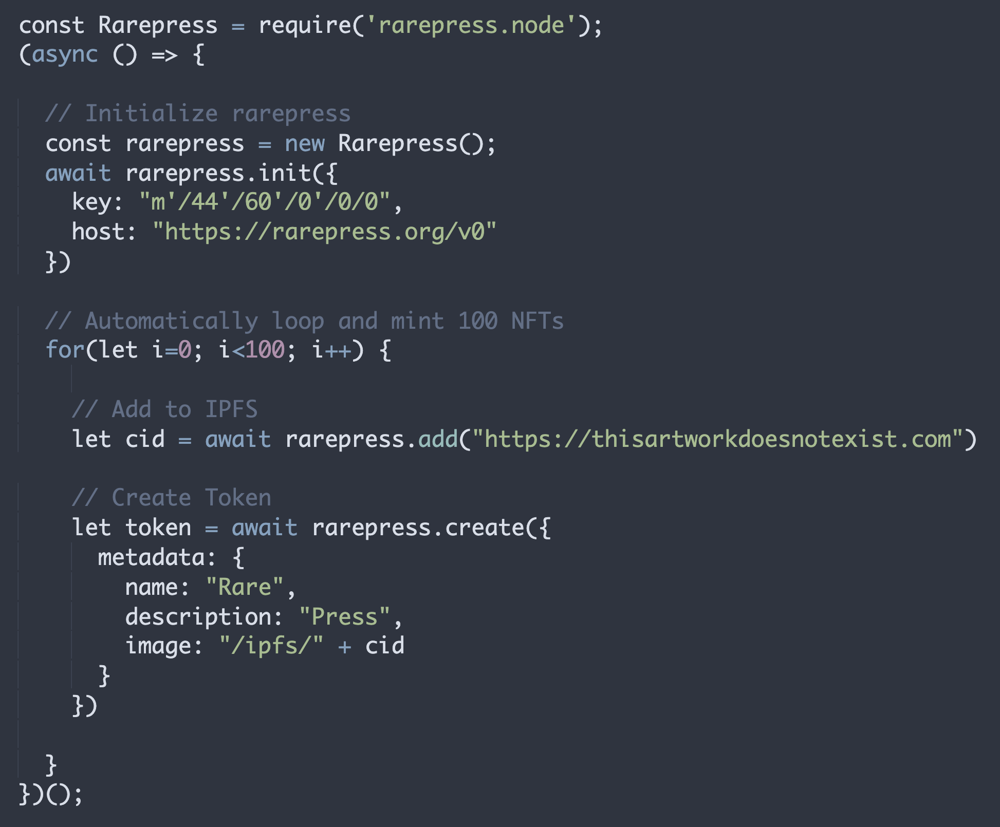

# rarepress.node

> Rarepress for Node.js



# What is this?

Rarepress.node is a part of the [rarepress](https://rarepress.org) stack that lets you mint NFTs from outside of the browser using node.js.

# How is it different from rarepress.js?

[rarepress.js](https://github.com/skogard/rarepress.js) is for running inside a browser, whereas rarepress.node is for running outside of browsers. Here are some differences:

1. **built-in wallet:** Rarepress.node has a wallet built-in.
2. **multi identity:** Rarepress.node lets you mint and trade from as many wallets as you want.
3. **automatic:** Rarepress.node doesn't require manual signature approval so you can automatically mint as many NFTs as you want.

---

# Install

```
npm install rarepress.node
```

---

# Quickstart

Try the examples under the [demo](demo) folder. First clone the repository:

```
git clone https://github.com/skogard/rarepress.node.git
```

Install the dependencies:

```
cd rarepress.node && npm install
```

And finally run each file in the folder to test. Here's an example:

```
node demo/tokenize
```

---

# Syntax

## Initialize

The only part different from [rarepress.js](https://github.com/skogard/rarepress.js) is the initizlization step:

```
const Rarepress = require('rarepress-node')
const rarepress = new Rarepress()
await rarepress.init({
  key: <BIP44 derivation path (optional)>,
  host: <Rarepress host URL>
})
```

1. `key`: (optional) The [bip44](https://github.com/bitcoin/bips/blob/master/bip-0044.mediawiki) derivation path. If unspecified, it will use the default Ethereum key path of `m'/44'/60'/0'/0/0`.
2. `host`: The rarepress host URL (see https://docs.rarepress.org/#/?id=init)

## Usage

Once initialized, the syntax is EXACTLY the same as [rarepress.js](https://github.com/skogard/rarepress.js).

Read the documentation at https://docs.rarepress.org/.

---

# Key Management

Rarepress uses a programmable wallet called mushie, to manage keys.

To directly interact with the wallet from the command line, install mushie globally.

```
npm install -g mushie
```

From this point on, you can run the commands directly:

1. Export seed: `mushie export`
2. Import seed: `mushie import`
3. Generate random seed: `mushie generate`

